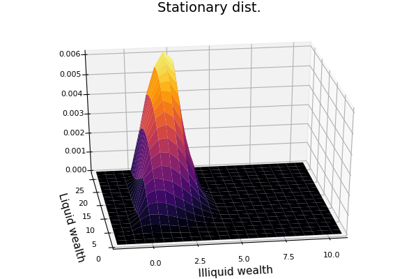

# two assets model in continuous time

this code solves the continuous time version of the two asset models with adjustment cost presented in [kaplan and violante (2014)](https://onlinelibrary.wiley.com/doi/abs/10.3982/ECTA10528) and [kaplan, moll and violante (2018)](https://www.aeaweb.org/articles?id=10.1257/aer.20160042).

it is mostly a replication of [ben moll's matlab code](http://www.princeton.edu/%7Emoll/HACTproject.htm).

### use

once cloned on your computer, run

```julia
p, hh = TwoAssetsContinuousTime.hjb()   # solves for the policy functions
TwoAssetsContinuousTime.kde!(p, hh)     # solves for the stationary distribution
```

to change the calibration, modify the ``src/params.json`` file.

### results

the stationary distribution over illiquid and liquid wealth for the high income households looks like

<p align = "center">
  
</p>

the remaining figures can be found in the ``fig/`` folder.
